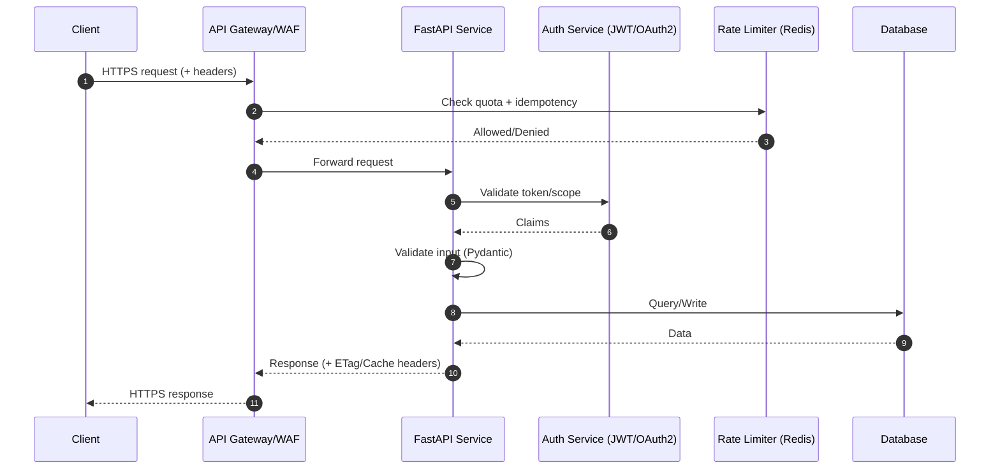
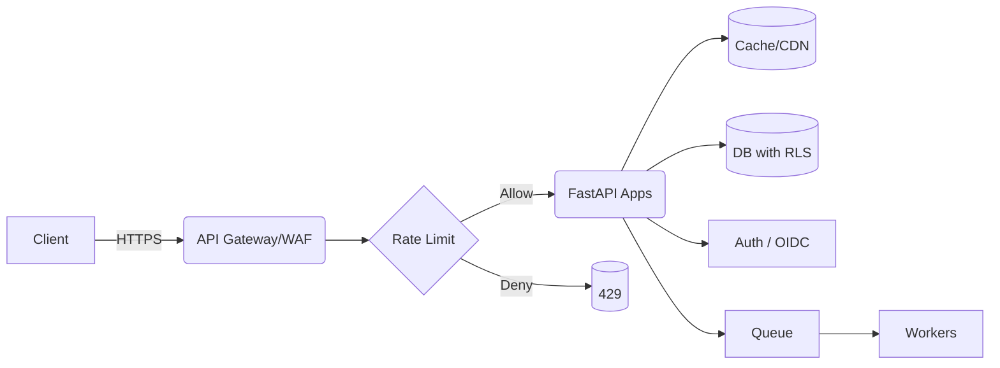

---
authors:
    - subhajit
title: Designing Secure and Scalable APIs — A Comprehensive Guide
description: Practical guide to API design, security, observability, and reliability with FastAPI examples and checklists.
slug: secure-scalable-apis-guide
date:
    created: 2025-09-24
categories:
    - Python
    - System Design
meta:
    - name: keywords
      content: Secure API Design, Scalable APIs, FastAPI Best Practices
twitter_card: "summary_large_image"
---

APIs are the connective tissue of modern products. This guide distills proven practices for API design, security, observability, and reliability—covering the most frequent questions and edge cases teams face in production. Examples use FastAPI and Pydantic v2, but the principles generalize to any stack.

<!-- more -->

## Architecture Overview



## Design Principles

- **Clarity over cleverness**: predictable URLs, consistent verbs, stable contracts.
- **Backward compatibility**: versioning and additive changes; deprecate before removal.
- **Idempotency**: safe retries for non-GET operations.
- **Least privilege**: scope- and role-based access; tenant isolation.
- **Defense in depth**: TLS everywhere, input validation, WAF, rate limiting.
- **Observability by default**: correlation IDs, structured logs, metrics, traces.

## REST vs GraphQL vs gRPC

- **REST**: simple, cache-friendly, great for public APIs; expressive with query params and headers.
- **GraphQL**: flexible querying; beware N+1, authorization at field-level, and cost limits.
- **gRPC**: high-performance binary protocol; strong contracts with Protobuf; great for service-to-service.

Pick based on clients, performance profile, and operability. Many orgs mix: REST externally, gRPC internally.

## Resource Modeling and URLs

- **Plural resources**: `/users`, `/users/{user_id}`.
- **Nesting when it clarifies ownership**: `/projects/{id}/members`.
- **Filtering, sorting, pagination** via query params:
  - `GET /orders?status=shipped&sort=-created_at&limit=50&cursor=...`
- **Partial responses**: `fields=name,email` or `Prefer: return=representation`.
- **Standard headers**: `ETag`, `If-None-Match`, `If-Match`, `Cache-Control`.

## Versioning Strategy

- URL-based: `/v1/...` for public APIs.
- Header-based: `Accept: application/vnd.example.v2+json` for internal APIs.
- Contract changes must be additive where possible. For breaking changes: run V1 and V2 concurrently; offer migration guides; set an end-of-life date.

## Error Handling and Problem Details

Use consistent error shapes and HTTP status codes.

```json
{
  "type": "https://docs.example.com/errors/rate_limited",
  "title": "Too Many Requests",
  "status": 429,
  "detail": "Try again in 12 seconds",
  "instance": "req_01J8Z6...",
  "extras": {"retry_after": 12}
}
```

Map business errors to appropriate statuses: 400 (validation), 401/403 (authz), 404 (not found), 409 (conflict), 422 (semantic validation), 429 (rate limit), 5xx (server).

## Validation, Schemas, and OpenAPI (FastAPI + Pydantic v2)

```py
from typing import Optional, Literal
from fastapi import FastAPI, HTTPException, Header, Depends, status
from pydantic import BaseModel, Field, field_validator

app = FastAPI(title="Orders API", version="1.0.0")

class CreateOrder(BaseModel):
    product_id: str = Field(min_length=1)
    quantity: int = Field(gt=0, le=1000)
    currency: Literal["USD", "EUR", "INR"]
    note: Optional[str] = Field(default=None, max_length=280)

    @field_validator("product_id")
    @classmethod
    def validate_product_id(cls, v: str) -> str:
        if not v.startswith("prod_"):
            raise ValueError("product_id must start with 'prod_'")
        return v

class Order(BaseModel):
    id: str
    status: Literal["pending", "confirmed"]
    etag: str

def require_idempotency_key(x_idempotency_key: Optional[str] = Header(default=None)) -> str:
    if not x_idempotency_key:
        raise HTTPException(status_code=status.HTTP_400_BAD_REQUEST, detail="Missing X-Idempotency-Key")
    return x_idempotency_key

@app.post("/v1/orders", response_model=Order, status_code=status.HTTP_201_CREATED)
async def create_order(payload: CreateOrder, idemp_key: str = Depends(require_idempotency_key)) -> Order:
    # Pseudocode: check Redis for idempotency key; return stored response if exists
    # save_idempotency(idemp_key, response_hash)
    return Order(id="ord_123", status="pending", etag="W/\"abc123\"")
```

## Pagination and Filtering

- Prefer **cursor-based** pagination for mutable datasets; **offset-based** for stable datasets.
- Include `Link` headers and `next_cursor` in body. Keep page sizes bounded.

## Concurrency Control and Caching

- Use `ETag` with `If-Match` for optimistic concurrency updates.
- Use `ETag` with `If-None-Match` for conditional GETs to enable 304 responses.
- Set `Cache-Control` wisely; avoid caching personalized responses unless keyed by auth.

```py
from fastapi import Request, Response

@app.get("/v1/orders/{order_id}")
async def get_order(order_id: str, request: Request) -> Response:
    etag = 'W/"abc123"'
    if request.headers.get("if-none-match") == etag:
        return Response(status_code=304)
    body = {"id": order_id, "status": "confirmed"}
    return Response(content=app.openapi_json_dumps(body), media_type="application/json", headers={"ETag": etag})
```

## Authentication and Authorization

### Options

- **API Keys**: simple, rotate often; restrict by IP/referrer; least privilege.
- **OAuth2/JWT**: bearer tokens with scopes (`read:orders`, `write:orders`). Verify signature, issuer, audience, expiry, and `nbf`.
- **mTLS**: strong service-to-service auth; pin certs; rotate.

### Scope- and Role-based Access

```py
from typing import List
from fastapi import Security
from fastapi.security import HTTPAuthorizationCredentials, HTTPBearer

bearer = HTTPBearer(auto_error=True)

def verify_jwt_and_scopes(creds: HTTPAuthorizationCredentials = Security(bearer), required_scopes: List[str] = []) -> dict:
    token = creds.credentials
    # Pseudocode: decode and validate token (iss, aud, exp, nbf) and scopes
    claims = {"sub": "user_1", "scopes": ["read:orders", "write:orders"], "tenant": "acme"}
    if not set(required_scopes).issubset(set(claims["scopes"])):
        raise HTTPException(status_code=403, detail="insufficient_scope")
    return claims

@app.get("/v1/orders", dependencies=[Depends(lambda: verify_jwt_and_scopes(required_scopes=["read:orders"]))])
async def list_orders() -> dict:
    return {"data": []}
```

### Multi-tenant Isolation

- Include a `tenant_id` claim and enforce it in every query.
- Use row-level security (RLS) in the database; never trust the client to filter tenants.

## Input Hardening and Output Encoding

- Validate types, ranges, and formats with Pydantic; reject unknown fields.
- Enforce maximum sizes: body, arrays, strings. Limit uploaded file size and type.
- Normalize Unicode and strip control characters when relevant.
- Always JSON-encode responses and set `Content-Type: application/json; charset=utf-8`.

## Rate Limiting and Abuse Protection

- Combine **IP** + **user** + **token** keys. Separate read/write limits.
- Use sliding window + burst; add Retry-After headers.

```py
import time
import hashlib

FAKE_BUCKET: dict[str, list[float]] = {}

def rate_limit(key: str, limit: int, window_seconds: int = 60) -> None:
    now = time.time()
    bucket = FAKE_BUCKET.setdefault(key, [])
    FAKE_BUCKET[key] = [t for t in bucket if t > now - window_seconds]
    if len(FAKE_BUCKET[key]) >= limit:
        raise HTTPException(status_code=429, detail="rate_limited")
    FAKE_BUCKET[key].append(now)

@app.post("/v1/orders/confirm")
async def confirm_order() -> dict:
    key = hashlib.sha256(b"anonymous").hexdigest()
    rate_limit(key, limit=5, window_seconds=60)
    return {"status": "ok"}
```

## Webhooks Security

- Sign payloads with an HMAC shared secret; include timestamp to prevent replay.
- Verify using constant-time comparison.

```py
import hmac, hashlib
from fastapi import Request

def verify_webhook_signature(request: Request, secret: str) -> None:
    signature = request.headers.get("x-signature")
    timestamp = request.headers.get("x-timestamp")
    if not signature or not timestamp:
        raise HTTPException(status_code=400, detail="missing_signature")
    payload = (timestamp + "." + (request._body.decode() if hasattr(request, "_body") else "")).encode()
    expected = hmac.new(secret.encode(), payload, hashlib.sha256).hexdigest()
    if not hmac.compare_digest(signature, expected):
        raise HTTPException(status_code=401, detail="invalid_signature")
```

## Transport Security (TLS) and Headers

- Enforce TLS 1.2+; prefer TLS 1.3; disable weak ciphers.
- HSTS (`Strict-Transport-Security`), `X-Content-Type-Options: nosniff`, `Referrer-Policy: no-referrer`, `Content-Security-Policy` for portals.
- Enable `gzip/br` compression; negotiate via `Accept-Encoding`.

## CORS and CSRF

For browser clients, configure CORS precisely; use CSRF tokens for cookie-based sessions.

```py
from fastapi.middleware.cors import CORSMiddleware

app.add_middleware(
    CORSMiddleware,
    allow_origins=["https://app.example.com"],
    allow_credentials=True,
    allow_methods=["GET", "POST", "PATCH", "DELETE"],
    allow_headers=["Authorization", "Content-Type", "X-Idempotency-Key"],
)
```

## Observability: Logging, Metrics, Tracing

- Generate a `request_id` per request; include it in logs and responses.
- Emit structured JSON logs; include user, tenant, route, latency, status.
- Expose Prometheus metrics; instrument with OpenTelemetry for traces.

```py
import uuid
import time
from fastapi import Request

@app.middleware("http")
async def add_request_context(request: Request, call_next):
    request_id = str(uuid.uuid4())
    start = time.time()
    response = await call_next(request)
    response.headers["x-request-id"] = request_id
    response.headers["server-timing"] = f"app;dur={(time.time()-start)*1000:.1f}"
    return response
```

## Reliability: Timeouts, Retries, Circuit Breakers

- Server timeouts must be lower than client timeouts. Never block indefinitely.
- Retries only on idempotent operations; use exponential backoff + jitter.
- Circuit breakers to shed load and protect dependencies.

## Data Privacy and Compliance

- Classify data (public/internal/confidential/PII). Encrypt at rest and in transit.
- Minimize logs; redact secrets and PII. Respect data residency.
- Provide data export and deletion endpoints where required (GDPR/CCPA).

## Change Management and Deprecation

- Communicate changes: changelog, email, and deprecation headers.
- Provide a sunset date and migration guide; support old and new versions in parallel.

## Testing Strategy

- Unit-test validators and authorization rules.
- Contract tests from OpenAPI; validate examples and `schemaFormat`.
- Load tests for hot paths; chaos experiments for failure modes.

## Deployment Topology (Reference)



## Checklist (Copy/Paste)

- AuthN: JWT validated (iss, aud, exp, nbf), scopes enforced
- AuthZ: RBAC/ABAC, tenant isolation, RLS in DB
- Transport: TLS 1.2+, HSTS, secure headers, compression
- Input: strict schemas, size limits, allowlist validation
- Output: content-type set, ETag/Cache-Control
- Idempotency: keys for POST; retries safe
- Rate limiting: per-IP/user/token; 429 with Retry-After
- Observability: request_id, structured logs, traces, metrics
- Reliability: timeouts, backoff, circuit breakers
- Change mgmt: versioning, deprecation plan, migration docs
- Privacy: PII minimization/redaction, encryption at rest/in transit

## FAQ: Common Questions

- "Should I use UUIDs or integers for IDs?" → UUIDv7 is a good default; avoid guessable IDs.
- "One big endpoint or many small ones?" → Model business resources; avoid RPC over HTTP unless using gRPC.
- "When to break a monolith?" → When independent scaling, deployment cadence, or ownership boundaries demand it.
- "Do I need an API gateway?" → Yes for public APIs (WAF, auth offload, rate limiting, routing). Internal-only can defer with service mesh.
- "How do I prevent replay attacks?" → Require idempotency keys and/or signed, timestamped requests; enforce short clock skew.
- "What about GraphQL security?" → Enforce query depth/complexity limits; field-level auth; persisted queries.

## Conclusion

Great APIs are predictable, secure, and observable. Start with clear resource modeling, layer defenses, and instrument from day one. Iterate safely with versioning and robust test coverage. The practices above form a pragmatic baseline you can tailor to your domain.


