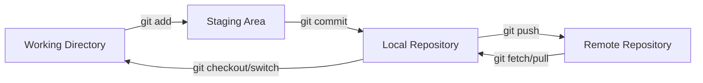
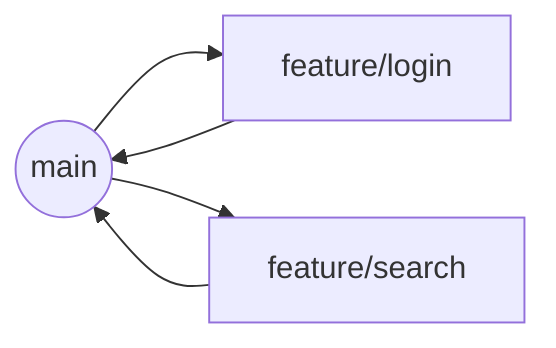
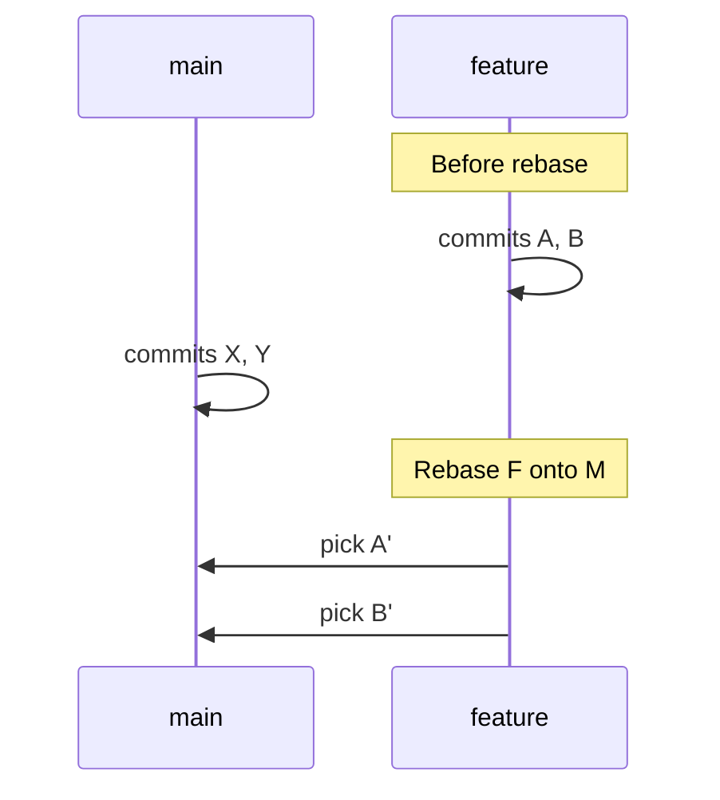
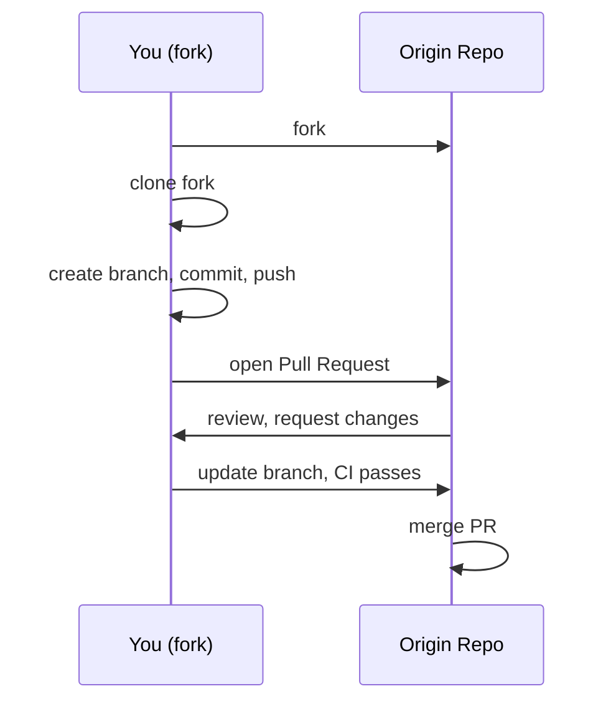

Version control is the foundation of reliable software delivery. This guide teaches Git from first principles, then layers in practical GitHub workflows used by high-performing teams. You’ll learn the mental models, the everyday commands, and the advanced tools to collaborate confidently without fear of breaking anything.

<!-- more -->

## What Is Version Control (and Why It Matters)

Version control systems track changes to files over time so you can collaborate, audit history, and restore previous states. Git is a distributed VCS: every clone contains the entire history, enabling fast local operations and offline work. GitHub is a hosting and collaboration platform built on top of Git.

=== "Git vs GitHub"

    - Git: command-line tool and file format for versioning
    - GitHub: remote hosting, Pull Requests, Issues, Actions, Discussions, Packages

=== "Centralized vs Distributed"

    - Centralized (e.g., SVN): single server of truth
    - Distributed (Git): many full copies; collaboration via push/pull/fetch

## The Git Mental Model

Git tracks content snapshots and references. The three most important zones are the working directory, the staging area (index), and the local repository.



Think in small, logical commits that tell a story. Branch to isolate work. Merge or rebase to integrate.

## Install and Configure Git

=== "macOS"

    ```bash
    brew install git
    git --version
    ```

=== "Windows (PowerShell)"

    ```powershell
    winget install --id Git.Git -e
    git --version
    ```

=== "Linux"

    ```bash
    sudo apt update && sudo apt install -y git       # Debian/Ubuntu
    sudo dnf install -y git                           # Fedora
    git --version
    ```

### First-Time Setup

```bash
git config --global user.name "Your Name"
git config --global user.email "you@example.com"
git config --global init.defaultBranch main
git config --global core.editor "code --wait"       # VS Code as editor
git config --global pull.rebase false                # start with merges
```

Optional but recommended:

```bash
# Better diffs and helpful aliases
git config --global color.ui auto
git config --global alias.st status
git config --global alias.co checkout
git config --global alias.br branch
git config --global alias.ci commit
git config --global alias.last 'log -1 --stat'
```

## Create or Clone a Repository

=== "Start a new repo"

    ```bash
    mkdir hello-git && cd hello-git
    git init
    echo "# Hello Git" > README.md
    git add README.md
    git commit -m "chore: initial commit"
    ```

=== "Clone existing"

    ```bash
    git clone https://github.com/owner/repo.git
    cd repo
    ```

## Everyday Workflow

```bash
# 1) See what changed
git status
git diff                     # unstaged changes
git diff --staged            # staged vs last commit

# 2) Stage what you want to commit
git add path/to/file
git add -p                   # interactively stage hunks

# 3) Commit with a meaningful message
git commit -m "feat: add user search by email"

# 4) Update your branch from remote
git pull                     # merge-based (default here)
# or: git pull --rebase      # rebase-based

# 5) Push your work
git push -u origin my-feature
```

### Commit Message Best Practices

- Use imperative mood: "fix bug", "add feature"
- Keep subject ≤ 72 chars; add details in body if needed
- Consider Conventional Commits for automation:

```text
<type>(<scope>): <subject>

feat(search): add email filter to users list

Body explaining why, not what. Reference issues if useful.
```

## Branching Strategies

Common strategies include Trunk-Based Development and Git Flow. Most teams today prefer Trunk-Based with short-lived feature branches and frequent merges.



### Create, Switch, and Delete Branches

```bash
git switch -c feature/search-ui   # create and switch
git switch main                   # go back
git branch -d feature/search-ui   # delete merged branch
git branch -D old-experiment      # force delete
```

## Merge vs Rebase

Both integrate changes. Merge preserves history; rebase rewrites your branch to apply on top of a base branch.

=== "Merge (safe, non-destructive)"

    ```bash
    git switch feature/login
    git merge main
    # resolves conflicts, creates a merge commit
    ```

=== "Rebase (linear history)"

    ```bash
    git switch feature/login
    git rebase main
    # replay commits atop main; fix conflicts along the way
    # if stuck: git rebase --abort   or   git rebase --continue
    ```



## Handling Conflicts

Conflicts occur when the same lines changed in both branches.

```bash
# After pull/merge/rebase reports conflicts:
git status                         # see conflicted files

# Edit files, resolve conflict markers <<<<<<< ======= >>>>>>>

git add path/to/conflicted-file
git commit                         # for merge
git rebase --continue              # for rebase
```

Tips:
- Resolve small, logical conflicts first
- Prefer consistent formatting to reduce diff noise
- Run tests before pushing

## Undo and Recover Safely

=== "Unstage changes"

    ```bash
    git restore --staged path/to/file
    ```

=== "Discard local edits"

    ```bash
    git restore path/to/file         # careful: this loses changes
    ```

=== "Amend last commit"

    ```bash
    git commit --amend -m "fix: correct typo in docs"
    ```

=== "Revert a bad commit (public history safe)"

    ```bash
    git revert <commit_sha>
    ```

=== "Time travel with reflog"

    ```bash
    git reflog                       # shows where HEAD moved
    git checkout <sha>
    ```

## Stashing Work-in-Progress

```bash
git stash push -m "wip: partial search filters"
git stash list
git stash show -p stash@{0}
git stash pop     # apply + drop
git stash apply   # apply only
```

## Tags and Releases

```bash
git tag -a v1.0.0 -m "First stable release"
git push --tags
```

Use annotated tags for semantic versioning; create GitHub Releases from tags for changelogs and assets.

## GitHub Fundamentals

- Repositories: public or private
- Issues: track tasks/bugs with labels, assignees, and milestones
- Pull Requests (PRs): propose changes; enable reviews and checks
- Discussions: community Q&A and proposals
- Projects: kanban planning
- Wikis: long-form documentation

### HTTPS vs SSH (and Tokens)

```bash
# HTTPS clone (uses PAT on push)
git clone https://github.com/owner/repo.git

# SSH clone (key-based)
ssh-keygen -t ed25519 -C "you@example.com"
ssh-add ~/.ssh/id_ed25519
git clone git@github.com:owner/repo.git
```

For HTTPS pushes, create a Personal Access Token (fine-grained) and use it as the password. For SSH, upload your public key to GitHub.

### Fork-and-PR vs Shared-Repo



### Opening an Effective PR

- Keep PRs small and focused
- Write a clear title and description (why, tradeoffs, screenshots)
- Link Issues and Discussions
- Ensure CI passes and tests are updated
- Request specific reviewers and use code owners when applicable

## Protecting Main and Enforcing Quality

- Protected branches: require PR, reviews, status checks, linear history
- Required checks: unit tests, lint, type-check, build
- Code owners: automatic review assignment
- Bypass rules for admins sparingly

## Automate with GitHub Actions (CI/CD)

```yaml
name: ci
on: [push, pull_request]
jobs:
  build:
    runs-on: ubuntu-latest
    steps:
      - uses: actions/checkout@v4
      - uses: actions/setup-node@v4
        with:
          node-version: 20
      - run: npm ci
      - run: npm test -- --ci
```

Add environment protections for deploy jobs; use environments, required reviewers, and secrets.

## Keep Repos Healthy

- .gitignore: avoid committing build artifacts, secrets, large files
- LICENSE: make intent explicit
- README: quickstart, architecture, contribution guide
- CONTRIBUTING.md, CODE_OF_CONDUCT.md, SECURITY.md
- Small, coherent commits; squash or rebase before merge if noisy

## Large Files and Monorepos

=== "Git LFS"

    ```bash
    git lfs install
    git lfs track "*.bin"
    git add .gitattributes
    ```

=== "Sparse Checkout (partial clones)"

    ```bash
    git clone --filter=blob:none --no-checkout git@github.com:owner/huge-repo.git
    cd huge-repo
    git sparse-checkout init --cone
    git sparse-checkout set apps/web apps/api
    ```

## Security and Trust

- Sign commits and tags (GPG or SSH signatures)
- Use branch protections and required reviews
- Avoid pushing secrets; scan with GitHub Advanced Security or pre-commit hooks
- Rotate tokens; limit PAT scopes

### Sign Your Commits (GPG)

```bash
gpg --full-generate-key
gpg --list-secret-keys --keyid-format=long
git config --global user.signingkey <KEY_ID>
git config --global commit.gpgsign true
```

## Troubleshooting FAQ

=== "fatal: not a git repository"

    Run inside a repo or initialize one: `git init`.

=== "Permission denied (publickey)"

    Add your SSH key to the agent and GitHub; or use HTTPS + PAT.

=== "Updates were rejected because the remote contains work that you do not have"

    Pull first, resolve, then push: `git pull --rebase` or `git pull` then fix conflicts.

=== "How do I undo the last commit but keep my changes?"

    `git reset --soft HEAD~1`

=== "How do I remove a file from history (secret accidentally committed)?"

    Use `git filter-repo` or `git filter-branch`, then force-push and rotate secrets.

## Glossary (Quick Reference)

- Commit: snapshot with metadata
- Branch: movable pointer to a commit
- HEAD: your current checked-out commit/branch
- Remote: named reference to another repository (e.g., origin)
- Merge: combine histories with a merge commit
- Rebase: replay commits onto another base
- Tag: named pointer for releases

## Further Reading

- Git Book: `https://git-scm.com/book/en/v2`
- GitHub Docs: `https://docs.github.com`
- Conventional Commits: `https://www.conventionalcommits.org`

## Conclusion

You now have a practical toolbox and the mental models to use Git effectively and collaborate on GitHub with confidence. Start with small, clear commits; branch freely; integrate often; protect main; and automate quality with CI. As your team matures, refine policies and workflows—Git and GitHub will scale with you.


