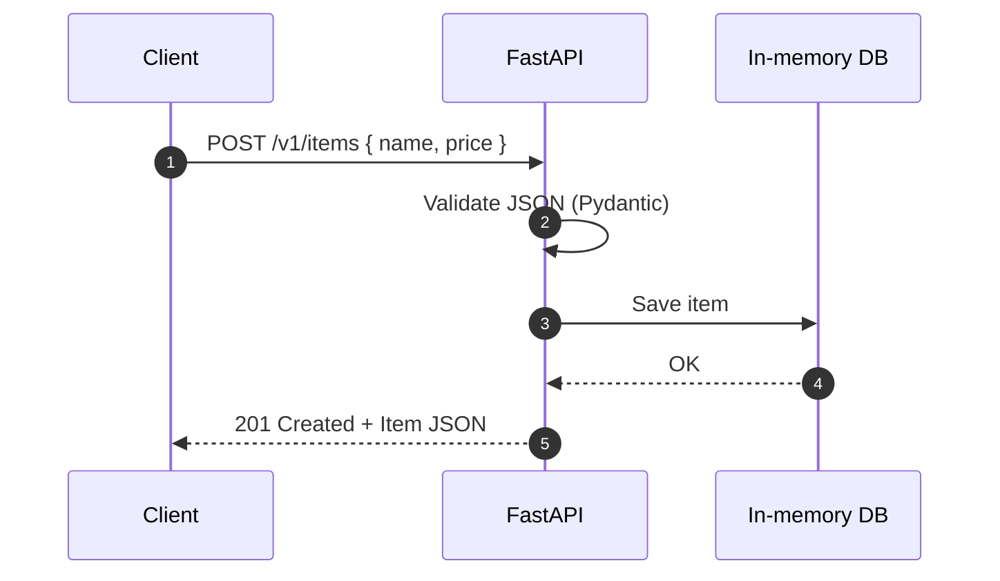
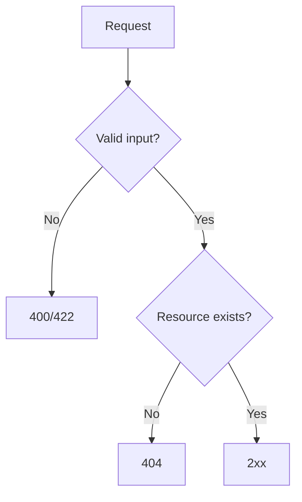

---
authors:
    - subhajit
title: API 101 — The Beginner’s Guide to Building and Securing APIs
description: Learn API basics step-by-step with simple HTTP concepts, a minimal FastAPI app, beginner security, diagrams, and a handy glossary.
date:
    created: 2025-09-24
categories:
    - Tech
    - Python
tags:
    - API
    - Beginner
    - FastAPI
    - Security
twitter_card: "summary_large_image"
---

New to APIs? This guide explains core concepts in clear language, then walks you through building a small FastAPI service with essential security and testing tips. When you’re ready for advanced patterns, read the companion: [Designing Secure and Scalable APIs — A Comprehensive Guide](./designing-secure-and-scalable-apis-a-comprehensive-guide.md).

<!-- more -->

## What Is an API?

An API is a contract for software to talk to software. It defines how to request data or perform actions using a consistent format over HTTP.

### REST vs GraphQL vs RPC (High Level)

- **REST**: resources (like `users`, `orders`) accessed via URLs and HTTP methods.
- **GraphQL**: clients ask for exactly the fields they need in a single endpoint.
- **RPC/gRPC**: function-style calls for service-to-service, very fast.

For beginners, start with REST.

## HTTP Essentials in 2 Minutes

- **Methods**: `GET` (read), `POST` (create), `PATCH` (update), `DELETE` (remove).
- **URLs**: `https://api.example.com/v1/items/123`.
- **Headers**: metadata like `Authorization`, `Content-Type`.
- **Status codes**: 2xx success, 4xx client errors, 5xx server errors.
- **JSON**: common data format: `{ "name": "Notebook", "price": 9.99 }`.

## A Minimal FastAPI Service

```py
from typing import Optional
from fastapi import FastAPI, HTTPException
from pydantic import BaseModel, Field

app = FastAPI(title="API 101", version="1.0.0")

class ItemIn(BaseModel):
    name: str = Field(min_length=1, max_length=100)
    price: float = Field(ge=0)
    description: Optional[str] = Field(default=None, max_length=280)

class ItemOut(BaseModel):
    id: str
    name: str
    price: float

DB: dict[str, ItemOut] = {}

@app.get("/v1/health")
async def health() -> dict:
    return {"status": "ok"}

@app.post("/v1/items", response_model=ItemOut, status_code=201)
async def create_item(item: ItemIn) -> ItemOut:
    new_id = f"it_{len(DB)+1}"
    output = ItemOut(id=new_id, name=item.name, price=item.price)
    DB[new_id] = output
    return output

@app.get("/v1/items/{item_id}", response_model=ItemOut)
async def get_item(item_id: str) -> ItemOut:
    if item_id not in DB:
        raise HTTPException(status_code=404, detail="item_not_found")
    return DB[item_id]
```

## Request/Response Flow



## Input Validation Basics

- Validate types and ranges (e.g., price >= 0).
- Keep strings bounded (e.g., name <= 100 chars).
- Return clear errors with `400`/`422` for invalid requests.

## Errors You’ll See Early

- `400/422` when the body is malformed or fields fail validation.
- `404` when an ID doesn’t exist.
- `405` when the method is wrong (e.g., `PUT` on a `GET` endpoint).

### Tiny Decision Tree



## Auth 101: API Keys vs Bearer Tokens

- **API Key**: static secret string in header `X-API-Key`. Simple, rotate often.
- **Bearer Token (JWT)**: signed token with claims (who you are, scopes). More flexible.

```py
from fastapi import Header, Depends

def require_api_key(x_api_key: str = Header(alias="X-API-Key")) -> None:
    if x_api_key != "demo_secret":
        raise HTTPException(status_code=401, detail="invalid_api_key")

@app.get("/v1/private", dependencies=[Depends(require_api_key)])
async def private_resource() -> dict:
    return {"message": "authorized"}
```

## CORS for Browser Apps

If your frontend runs on a different domain, enable CORS.

```py
from fastapi.middleware.cors import CORSMiddleware

app.add_middleware(
    CORSMiddleware,
    allow_origins=["http://localhost:5173", "https://app.example.com"],
    allow_credentials=True,
    allow_methods=["GET", "POST", "PATCH", "DELETE"],
    allow_headers=["Authorization", "Content-Type", "X-API-Key"],
)
```

## Pagination and Filtering (At a Glance)

- Offset: `GET /v1/items?offset=0&limit=20` — simple, good for small sets.
- Cursor: `GET /v1/items?cursor=abc&limit=20` — better for changing data.

## Idempotency (Why It Matters)

If clients retry a `POST`, you don’t want duplicate creations. Accept `X-Idempotency-Key` and reuse the original result for the same key.

## Rate Limiting (Conceptual)

Protect your API with per-user or per-IP limits. On limit exceeded, return `429` with `Retry-After` seconds.

## Testing Your API

- `curl` quick checks, Postman/Insomnia for collections.
- Read logs and status codes; verify headers and JSON.

### Handy curl Examples

```bash
curl -i https://api.example.com/v1/health
curl -i -X POST https://api.example.com/v1/items \
  -H 'Content-Type: application/json' \
  -d '{"name":"Pen","price":1.25}'
curl -i https://api.example.com/v1/items/it_1
```

## Beginner Hardening Checklist

- Validate all inputs with Pydantic.
- Set `Content-Type: application/json` in responses.
- Turn on CORS only for known origins.
- Use API keys or bearer tokens; never accept secrets in query strings.
- Add basic rate limiting and idempotency for writes.
- Log a `request_id` and include it in responses.

## Glossary

- **JWT**: signed token proving identity and permissions.
- **ETag**: a version tag for caching and concurrency.
- **CORS**: browser rule for cross-origin requests.
- **2xx/4xx/5xx**: success/client/server status code families.

## What’s Next

Ready to go deeper? See the advanced guide for versioning, ETags, RBAC, rate limiting, webhooks security, observability, and more: [Designing Secure and Scalable APIs — A Comprehensive Guide](./designing-secure-and-scalable-apis-a-comprehensive-guide.md).


