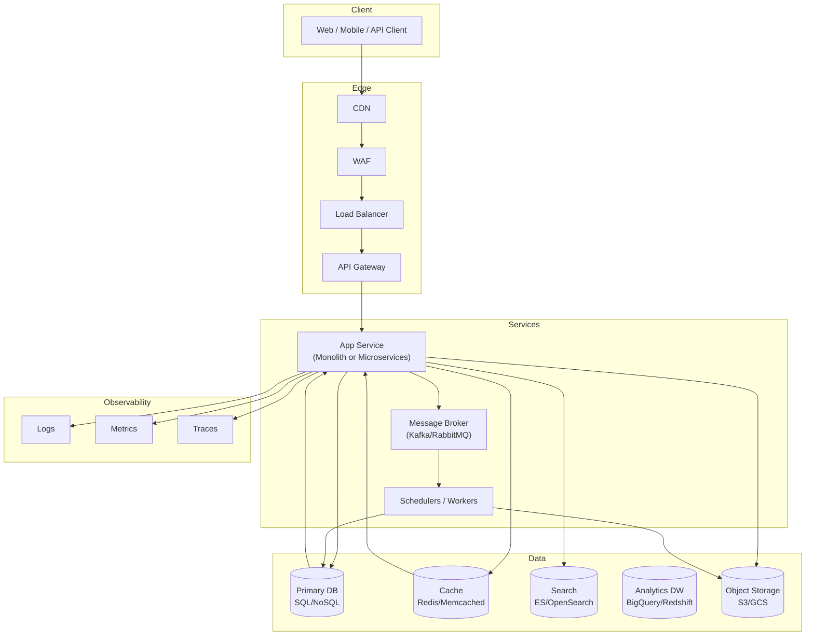
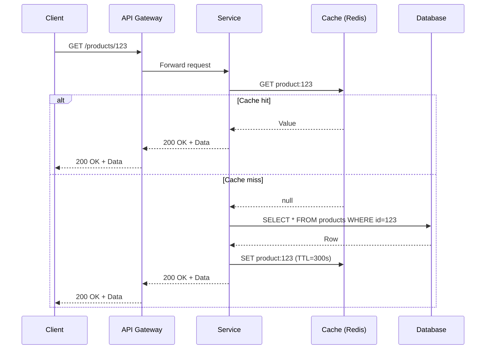
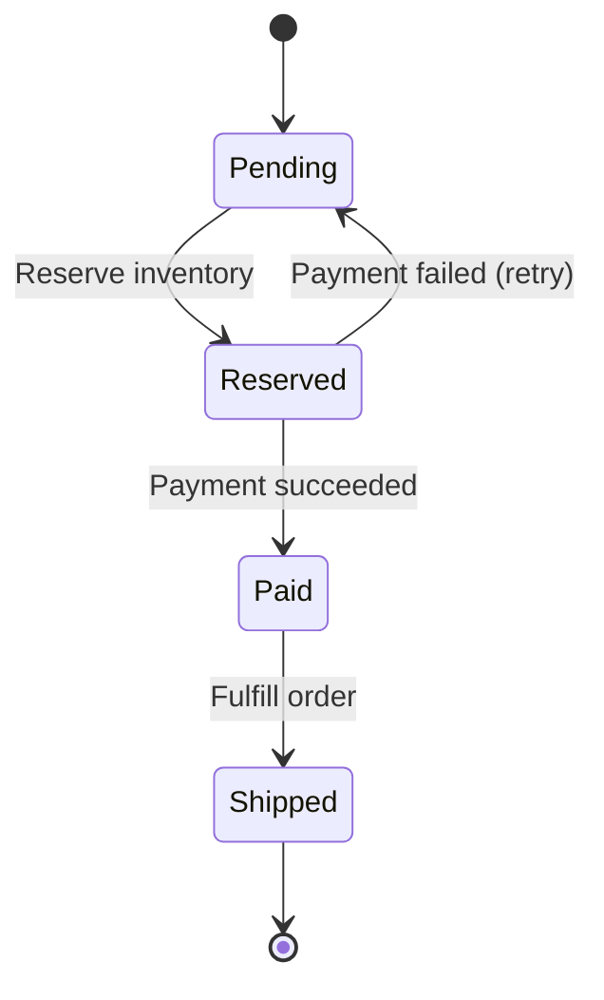
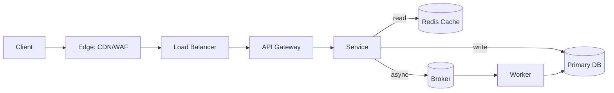

---
authors:
    - subhajit
title: System Architecture — A Comprehensive, Practical Guide
description: Practical guide to system architecture covering core concepts, patterns, trade‑offs, diagrams, and production checklists.
slug: system-architecture-comprehensive-guide
date:
    created: 2025-09-24
categories:
    - Tech
    - System Design
tags:
    - Architecture
    - Scalability
    - Reliability
twitter_card: "summary_large_image"
---

Designing and evolving system architecture is about making informed trade‑offs. This guide provides a practical, opinionated walkthrough of the core concepts, patterns, and decisions you need to build scalable, reliable, and cost‑efficient systems—plus answers to the most common questions engineers and architects ask.

<!-- more -->

## What Is System Architecture

System architecture describes the high‑level structure of a software system: the components, their responsibilities, and how they interact. It balances non‑functional requirements (NFRs) such as scalability, reliability, performance, security, operability, and cost.

- **Functional requirements**: What the system does (features, endpoints, business rules).
- **Non‑functional requirements (NFRs)**: How well the system does it (SLOs, throughput, latency, availability, durability, security, maintainability).

## Reference Architecture at a Glance

## Core Architectural Styles

=== "Layered (N‑Tier)"

    - **Idea**: Separate presentation, application, domain, and data layers.
    - **Pros**: Simple, clear separation; great for small to medium apps.
    - **Cons**: Can devolve into an anemic domain; boundaries erode over time.
    - **Use when**: Team is small; domain is evolving; deployment simplicity matters.

=== "Modular Monolith"

    - **Idea**: One deployable unit with strict internal modules and boundaries.
    - **Pros**: Transactional consistency, simple ops, easier refactoring.
    - **Cons**: One failure can impact more; scaling is coarse.
    - **Use when**: You want speed of delivery with discipline; future microservices possible.

=== "Microservices"

    - **Idea**: Independent services with clear bounded contexts.
    - **Pros**: Independent scaling/deployment; team autonomy; polyglot persistence.
    - **Cons**: Operational complexity; distributed transactions; consistency challenges.
    - **Use when**: Org is large; domains are well understood; platform engineering exists.

=== "Event‑Driven"

    - **Idea**: Publish/subscribe events for loose coupling and async processing.
    - **Pros**: Scalable, resilient, extensible.
    - **Cons**: Debuggability; eventual consistency; schema/versioning discipline needed.
    - **Use when**: High throughput, integrations, or async workflows are key.

## Data and Consistency Fundamentals

- **ACID vs BASE**: Strong consistency vs eventual consistency trade‑off.
- **CAP Theorem**: Under network partitions, pick availability or consistency.
- **Consistency models**: Strong, causal, read‑your‑writes, eventual.
- **Idempotency**: Same request can be safely retried; key for reliability.
- **Exactly‑once is aspirational**: Aim for at‑least‑once + idempotency.

### Typical Read/Write Flow

## Scalability Patterns

- **Vertical scaling**: Bigger machines; quick win; diminishing returns.
- **Horizontal scaling**: More instances; needs statelessness and externalized state.
- **Partitioning/Sharding**: Split data by key or range; consider rebalancing.
- **Replication**: Read replicas for scale; async replicas increase staleness risk.
- **Caching**: CDN, application cache (Redis), database cache; always set TTLs and invalidation rules.
- **Queueing & Backpressure**: Smooth spikes with buffers; implement consumer concurrency and rate limits.

## Reliability and Resilience

- **Timeouts and Retries**: Always set sane timeouts; use exponential backoff + jitter.
- **Circuit Breakers**: Fail fast when dependencies degrade; protect resources.
- **Bulkheads**: Isolate resource pools (threads/connections) per dependency.
- **Dead‑letter queues**: Capture poison messages for later review.
- **Graceful degradation**: Serve cached or partial data when possible.

## Datastores and When to Use Them

=== "Relational (PostgreSQL/MySQL)"

    - Strong consistency, joins, transactions. Best for OLTP and complex relationships.
    - Scale via read replicas, partitioning, and careful indexing.

=== "Document (MongoDB/Firestore)"

    - Flexible schemas, nested documents. Great for content/user profiles.

=== "Key‑Value (Redis/Memcached)"

    - Sub‑millisecond reads/writes; perfect for caching, sessions, locks.

=== "Wide‑Column (Cassandra/Scylla)"

    - High write throughput, linear horizontal scalability; model queries up‑front.

=== "Search (Elasticsearch/OpenSearch)"

    - Full‑text search, aggregations; eventual consistency; pipeline ingestion.

=== "Analytics (BigQuery/Redshift/Snowflake)"

    - OLAP, columnar storage, separation of storage/compute; not for OLTP.

## Messaging and Async Workflows

- **Brokers**: Kafka (log‑based, high throughput), RabbitMQ (AMQP, routing), SQS/PubSub (managed).
- **Patterns**: Pub/Sub, Work Queues, Event Sourcing, CQRS, Saga for distributed transactions.

## API Gateway, BFF, and Edge

- **API Gateway**: Routing, authentication, rate limiting, request/response transformation.
- **BFF (Backend for Frontend)**: Tailored APIs per client (web/mobile) to reduce over/under‑fetching.
- **Edge (CDN/WAF)**: Caching static and semi‑static content; threat mitigation at the perimeter.

## Security by Design

- **AuthN/Z**: OAuth 2.1/OIDC for delegated auth; enforce least privilege and scopes.
- **Data protection**: TLS in transit; at‑rest encryption; KMS‑managed keys.
- **Secrets**: Use secret managers; never store secrets in env files or images.
- **Input validation**: Validate at the edge and service boundary; sanitize outputs.
- **Auditability**: Immutable, tamper‑evident logs for security events.

## Observability and Operability

- **Metrics**: RED/USE/Golden signals; per‑service SLOs with error budgets.
- **Logs**: Structured JSON, correlation IDs; centralize and retain with budgets.
- **Traces**: Distributed tracing with consistent propagation headers.
- **Runbooks**: Document failure modes and standard operating procedures.

## Deployments and Release Strategies

- **Blue/Green**: Two production environments; instant switch; higher cost.
- **Canary**: Gradual rollout with automated rollback on regression.
- **Feature Flags**: Decouple deploy from release; enable progressive delivery.

## Cost Awareness

- **Right‑sizing**: Match instance sizes to baselines; autoscale on credible signals.
- **Storage classes**: Hot vs warm vs cold tiers; lifecycle policies.
- **Data egress**: Minimize cross‑region and cross‑cloud traffic.

## Non‑Functional Requirements (NFR) Checklist

- SLOs for latency, availability, and error rates defined and monitored
- Capacity plan and autoscaling policies validated under load tests
- Backups, restore drills, and disaster recovery RPO/RTO defined
- Timeouts, retries with backoff, circuit breakers configured
- Idempotency for writes and exactly‑once semantics avoided
- Rate limits, quotas, and surge protection in place
- Security scanning (SAST/DAST), dependencies, base image hardening
- Observability: metrics, logs, traces, dashboards, alerts, runbooks
- Cost budgets and anomaly detection alerts

## Architecture Decision Records (ADR)

Document trade‑offs explicitly. A lightweight ADR captures context, decision, alternatives, and consequences. Keep ADRs short, versioned, and linked to incidents or KPIs when decisions change.

## Common Questions and Straight Answers

=== "Should I start with microservices?"

    No. Start with a well‑structured modular monolith. Split only when boundaries and scaling pain are clear.

=== "SQL or NoSQL?"

    Default to SQL. Move specific workloads to NoSQL if access patterns or scale demand it.

=== "How many replicas do I need?"

    At least 2 per AZ for HA; 3 for quorum‑based systems. Validate with load tests.

=== "How do I ensure safe retries?"

    Make write endpoints idempotent (idempotency keys) and use backoff + jitter.

=== "What about exactly‑once delivery?"

    Prefer at‑least‑once with idempotent consumers. Exactly‑once is costly and brittle in practice.

=== "Do I need a message broker?"

    Use one for async workloads, spikes, or integrations. Avoid if synchronous request/response suffices and throughput is modest.

=== "How do I handle schema changes?"

    Backward‑compatible changes first (additive), deploy readers, then writers; run dual‑writes if needed.

=== "When should I shard?"

    Only after exhausting vertical scale and read replicas. Choose a shard key that evenly distributes load and minimizes cross‑shard queries.

=== "How do I choose cache TTLs?"

    Base on data volatility and correctness tolerance. Prefer short TTLs and soft invalidation over long stale data.

=== "What causes cascading failures?"

    Tight coupling, unbounded concurrency, and missing timeouts. Use bulkheads, backpressure, and circuit breakers.

## Production Readiness Checklist

- Health checks (liveness/readiness/startup) and graceful shutdown
- Config via env/secret manager; immutable container images
- Canary strategy and automated rollback hooks
- Per‑endpoint SLOs and error budgets defined
- Rate limiting and abuse detection at the edge
- Data retention, privacy, PII handling, and audit trails
- Access control: least privilege IAM, scoped tokens, and short‑lived creds
- Runbook for all critical failure modes; on‑call rotation defined

## Example: Request Journey Through the Stack

## How to Evolve Architecture Safely

1. Define KPIs and SLOs. Measure before you change.
2. Make small, reversible steps. Use flags and canaries.
3. Prefer schema‑first and contract tests for APIs and events.
4. Automate. Everything. Testing, security scans, provisioning, rollbacks.
5. Document decisions (ADRs) and post‑incident learnings.

## Further Reading

- Designing Data‑Intensive Applications (Kleppmann)
- Site Reliability Engineering (Beyer et al.)
- Release It! (Nygard)
- The Twelve‑Factor App

## Conclusion

Good architecture maximizes option value by keeping systems observable, evolvable, and resilient. Start simple, measure relentlessly, and introduce complexity only when the data demands it. The best designs are those your team can operate confidently under failure.

